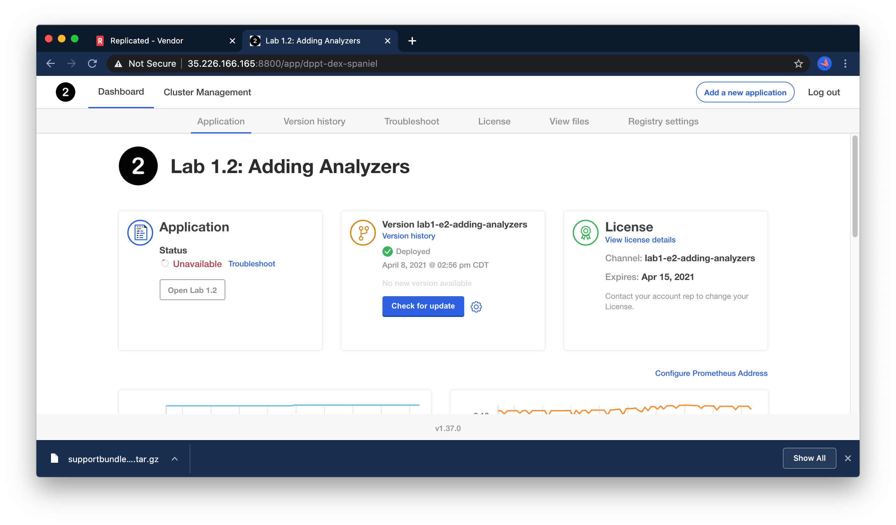
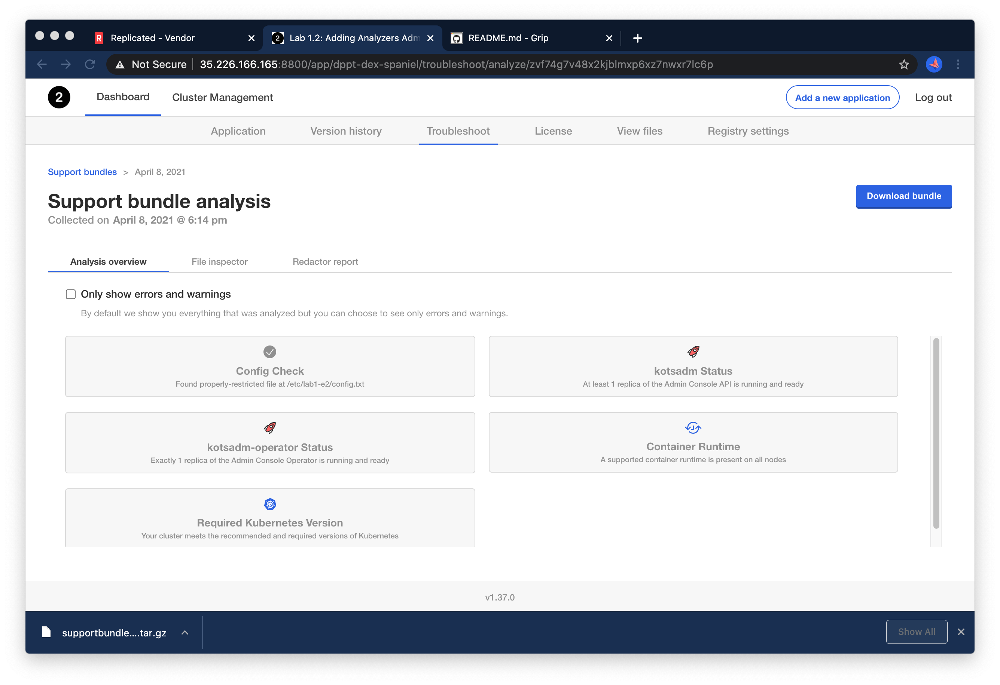
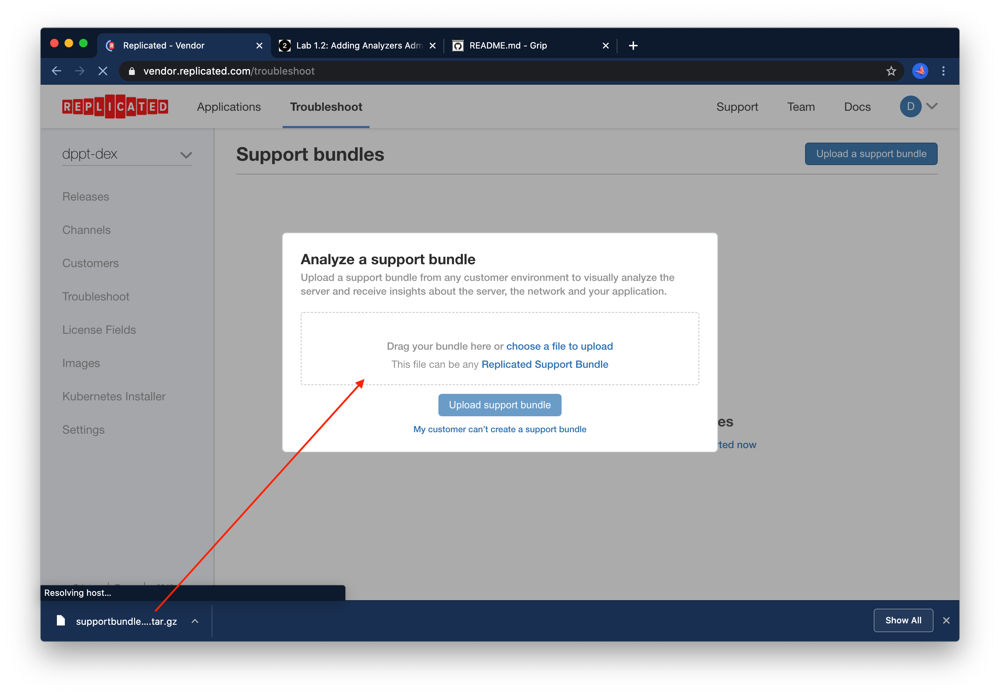
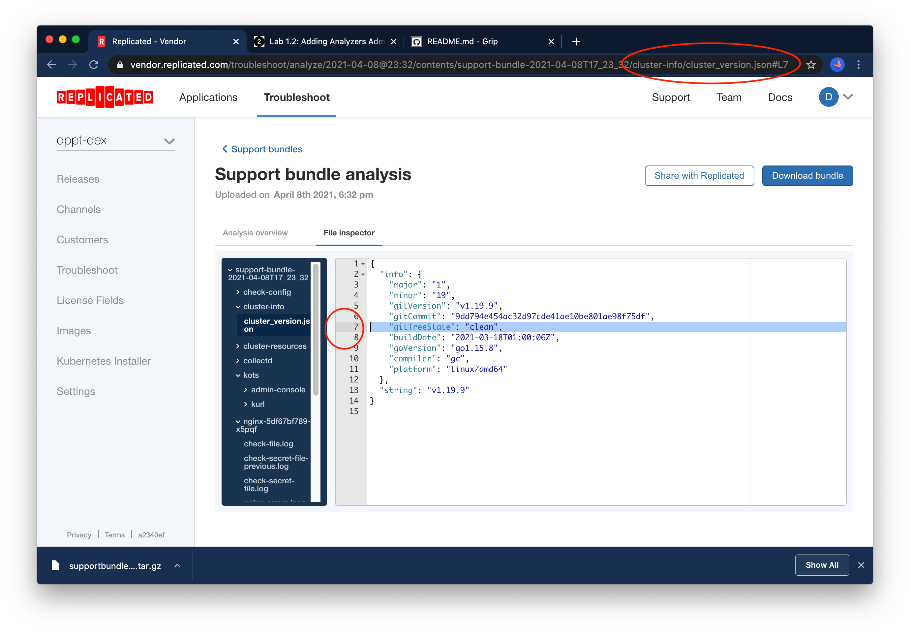
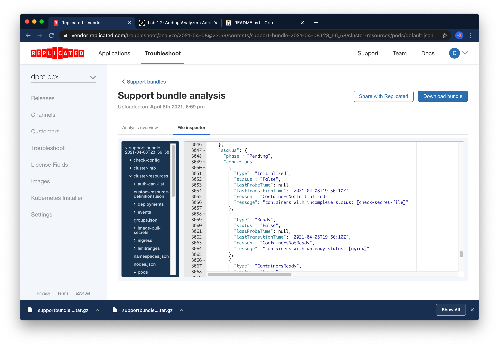
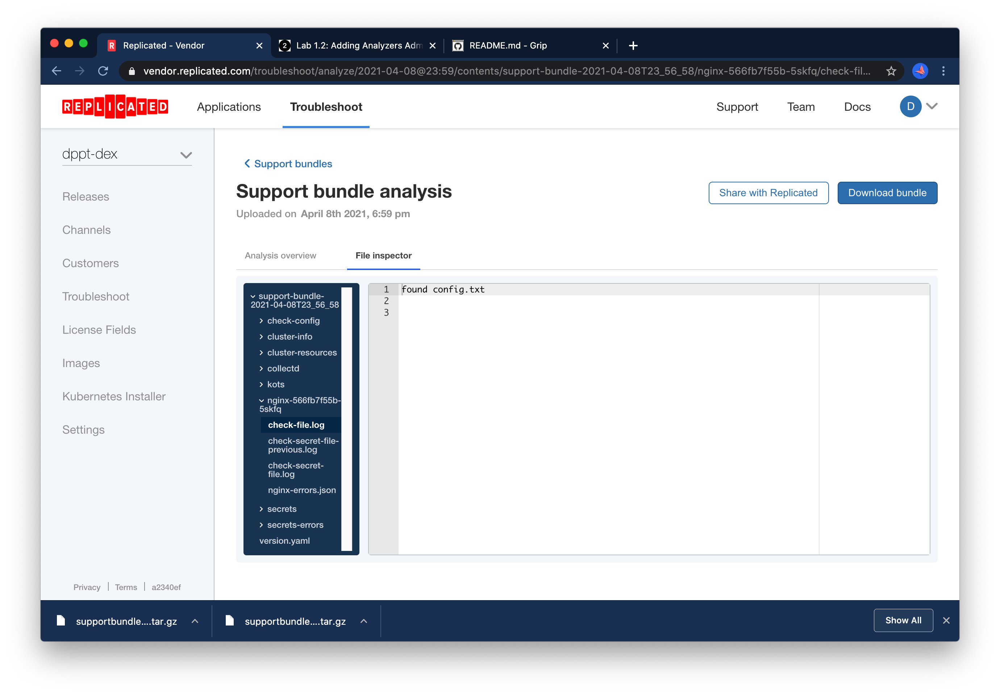

Lab 1.2: Support Analyzers
=========================================


**NOTE** to complete this lab, you will need to ensure you've set `REPLICATED_APP` and `REPLICATED_API_TOKEN` as you did in [Lab 1 Exercise 0](../lab0-hello-world) to add an analyzer.
If you haven't completed Exercise 0, you should go back and do that now.
It will take **15-30 minutes**.

### Ground Rules

In this lab and most of those that follow it, some of the failure scenarios are quite contrived.
It is very possible to reverse-engineer the solution by reading the Kubernetes YAML rather instead of following the lab steps.
If you want to get the most of out these labs, use the presented debugging steps to get experience with the toolset.

### Before you start

Before you start, it's worth noting that this server already has the `config.txt` file in place. You can SSH the
node before you start to verify

```shell
ls -l /etc/lab2/
```

You should see a properly-restricted file in place, so we won't need to worry about putting it in place.

```text
258371 -r-------- 1 root root 0 Apr  8 19:44 config.txt
```


### The Problem

You can open the KOTS admin console your your node by navigating to https://$IP_ADDRESS:8800 in a browser. The password to your instance will be provided as part of the lab, or you can reset by SSHing the node and running

```shell
kubectl kots reset-password -n default
```

Unfortunately, even though `config.txt` is present, the app is still not healthy:



Using what we learned in Lab 1.1, we can generate a support bundle to see what's wrong. 
Unfortunately, we'll find that all the analyzers are "info" level, and there are no errors or warnings for us to address:



### Investigating

The key lesson of this lab is around what to do if analyzers don't provide any useful information. 
We'll walk through downloading the bundle, collaborating with your team to diagnose the error, and preventing it in the future.

<div align="center"><blockquote><h3>If support analyzers don't surface any issues, the bundle should be downloaded and sent to the vendor team</h3></blockquote></div>

In this case, even though we're wearing a "customer" hat for parts of these exercises, "the vendor" is also you in this case :slightly_smiling_face:

Let's grab the bundle using the "download bundle" option so we can upload it to https://vendor.replicated.com to collaborate with the team:


Next, we'll navigate to https://vendor.replicated.com/troubleshoot and choose "upload bundle", then drag and drop the bundle you downloaded from the instance.
Having access to the instance to download the bundle simplifies things for us in this case.
In the real world, you can receive the bundle from a customer by whatever means is most secure/convenient for them.



Once its uploaded, you should see a similar view of the analyzers.


Again, nothing here is all the useful to us, but next we'll dig into the logs by navigating to the file inspector tab. 
We can use the line-level deep linking in the UI to highlight and share specific errors and log lines.

**Exercise** navigate to `cluster-info/cluster_version.json`, and determine the version of Kubernetes that is running on the server side.
Test the line-level linking by copying the URL into a new tab.
Then, in chat, to send the same link to another lab participant and ensure they can access the line in your bundle.



Note that as you click line numbers in the gutter, the URL changes.

<div align="center"><blockquote><h3>Once a bundle has been uploaded to the vendor console, use deep-linking to collaborate on the diagnosis with your team.</h3></blockquote></div>

These links can be attached to a support ticket, shared in slack, etc.

If you choose the "Share with Replicated" option in the https://vendor.replicated.com, the same links will become accessible to Replicated's support team.


### The issue

When we don't have an analyzer to tell us what's wrong, we end up looking through log files.
Fortunately, the support bundle includes a wealth of information about the cluster and our application's nginx pod.
Explore the files in the support bundle, either in the UI or by untarring locally, and see if you can figure out what's missing from the system.

1. Which pods, if any, are crashing.
1. What about the system is causing this.

The answers are below, but you should take at least a few minutes to explore what comes in a default bundle. 
In future labs, we'll learn to customize the information that gets included in the bundle.

Proceed to [Correcting](#correcting) only after you have an idea of what change you'd like to make to the host to correct the problem.

<details>
  <summary>Expand for a Hint</summary>

By navigating to `cluster-resources/pods/default.json`, we can see our nginx pod is still pending due to initContainers not completing:




More importantly, if we review the logs for the nginx pod, we can see that the
`check-file` container finshed just fine, but the `check-secret-file` container is failing:





```text
stat: can't stat '/etc/lab2/secretkey.txt': No such file or directory
```

It appears our initContainer relies on this file to proceed.

</details>


### Correcting

To correct the issue, let's address the problem we uncovered in the init container.

<details>
  <summary>Expand for a Hint</summary>

As with many infrastructure problems, now that we have diagnosed the issue, the fix is relatively simple.

```text
sudo touch /etc/lab2/secretkey.txt
sudo chmod 400 /etc/lab2/secretkey.txt
```

</details>

Once the fix is done, we can wait for the nginx pod to recover, or we can give the pod a nudge to get it to retry immediately:

```text
kubectl delete pod -l app=nginx
```

We can now verify that the app comes up as expected:


### Adding an Analyzer

The most important lesson to take away from this lab is that troubleshooting with logs should be a pathological event.
Any time you find yourself using logs to debug something, as did just now you should ask yourself 

> What analyzer could I write to prevent anyone else from having to read logs to diagnose this?
> 
> How can I present valuable diagnostic information directly to my customer, in the case that they're unable to send logs out of the environment?

So before we move on to the next issue, let's take some time to build and test an analyzer that will check for the existence of this `/etc/lab2/secretkey.txt`
as part of support bundle collection.

**NOTE** you will need to ensure you've set `REPLICATED_APP` and `REPLICATED_API_TOKEN` as you did in [Lab 1 Exercise 0](../lab0-hello-world) to add an analyzer.
If you haven't completed Exercise 0, you should go back and do that now. 
It will take **15-30 minutes**.

Open up a shell on your workstation wherever you have the `kots-field-labs` repository checked out,
and cd into the Lab 1.2 directory.

```shell
cd labs/lab2-adding-analyzers
```

The files we care about are in the `manifests` directory, most importantly, `kots-support-bundle.yaml`.
You'll want to review what's there, and the documentation on https://troubleshoot.sh is worth checking out too
For example, the check-file analyzer makes use of the [exec collector](https://troubleshoot.sh/docs/collect/exec/) 
and the [regex analyzer](https://troubleshoot.sh/docs/analyze/regex/).


Using the files there and the troubleshoot docs, add a collector + analyzer to check for the existence of /etc/lab2/secretkey.txt
and fail with a helpful error message if it's not there.

Make changes to your yaml, then run `make release` from the `lab2-adding-analyzers` directory to create a new release.
Test your changes by navigating to your KOTS UI's Version History tab, checking for updates, 
deploying the new version, collecting another support bundle, and reviewing the analyzers.

Iterate on your SupportBundle spec until you're happy with the analyzers. An example is available below.

<details>
  <summary>Expand for an Example</summary>

When you're done, your `kots-support-bundle.yaml` should look something like

```yaml
apiVersion: troubleshoot.sh/v1beta2
kind: SupportBundle
metadata:
  name: lab1e2
spec:
  collectors:
    - logs:
        selector:
          - app=nginx
        namespace: '{{repl Namespace }}'
        limits:
          maxAge: 30d
          maxLines: 10000
    - exec:
        name: check-config
        collectorName: check-config
        selector:
          - app=file-check-pod
        namespace: '{{repl Namespace}}'
        args:
          - stat
          - -c
          - "%a"
          - /etc/lab2/config.txt
    - exec:
        name: check-secret
        collectorName: check-secret
        selector:
          - app=file-check-pod
        namespace: '{{repl Namespace}}'
        args:
          - stat
          - -c
          - "%a"
          - /etc/lab2/secretkey.txt
  analyzers:
    - textAnalyze:
        checkName: Config Check
        fileName: check-config/{{repl Namespace}}/*/check-config-*.txt
        regex: '400'
        outcomes:
          - pass:
              message: Found properly-restricted file at /etc/lab2/config.txt
          - fail:
              message: Could not find a file at /etc/lab2/config.txt with 400 permissions -- please ensure this file exists with any content
    - textAnalyze:
        checkName: Secret Check
        fileName: check-secret/{{repl Namespace}}/*/check-secret-*.txt
        regex: '400'
        outcomes:
          - pass:
              message: Found properly-restricted file at /etc/lab2/secretkey.txt
          - fail:
              message: Could not find a file at /etc/lab2/secretkey.txt with 400 permissions -- please ensure this file exists with any content


```

</details>


To validate your analyzer works, you'll want to collect two support bundles, one when the secretkey.txt file is present and another when it is absent. 
You should confirm that in the "absent" case, your bundle analyis presents an error with helpful remediation info.

### Going deeper (optional)

If you finish up Lab 1.2 early, try your hand at the following exercise:

Instead of using `exec` + `textAnalyze` collector combo, could you use the existing `logs` collector for the nginx initContainers with a `textAnalyze` collector instead?